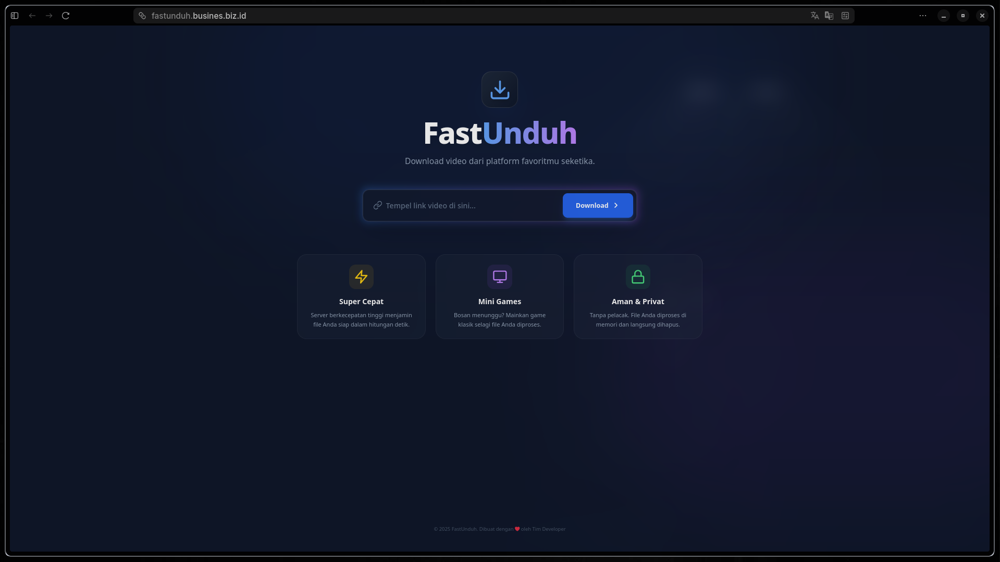

# FastUnduh ⚡



**FastUnduh** adalah aplikasi web modern untuk mengunduh video dari berbagai platform media sosial (YouTube, Instagram, TikTok, Twitter/X) dengan cepat, gratis, dan tanpa gangguan iklan.

Dibangun dengan antarmuka yang elegan (Glassmorphism) dan pengalaman pengguna yang interaktif, FastUnduh menghadirkan fitur unik: **Mainkan game klasik saat menunggu download selesai!**

## ✨ Fitur Unggulan

- **🚀 Super Cepat**: Dipersenjatai dengan backend Go yang efisien dan `yt-dlp`.
- **🛡️ Tanpa Iklan & Aman**: Tidak ada tracking, tidak ada pop-up iklan yang mengganggu.
- **🎮 Mini Games**: Bosan menunggu? Mainkan Snake, Tic Tac Toe, 2048, Memory Card, atau Tebak Angka langsung di browser.
- **📱 Responsive**: Tampilan optimal di Desktop dan Mobile.
- **🎨 UI Modern**: Menggunakan Vue 3 dengan sentuhan Glassmorphism dan animasi halus.

## 🛠️ Teknologi

Project ini menggunakan arsitektur Monorepo dengan stack teknologi berikut:

- **Frontend**: Vue 3, Vite, Tailwind CSS
- **Backend**: Go (Golang), yt-dlp (untuk pemrosesan video)
- **Database/Cache**: Redis
- **Infrastructure**: Docker & Docker Compose
- **Web Server**: Apache / Nginx (Reverse Proxy)

## 🚀 Cara Menjalankan (Deployment)

Pastikan Anda telah menginstal **Docker** dan **Docker Compose**.

1. **Clone Repository**
   ```bash
   git clone https://github.com/mel-cell/FastUnduh.git
   cd FastUnduh
   ```

2. **Jalankan dengan Docker Compose**
   ```bash
   docker compose up -d --build
   ```

3. **Akses Aplikasi**
   Buka browser dan kunjungi: `http://localhost:3006` (atau domain yang telah dikonfigurasi).

## 📂 Struktur Project

```
FastUnduh/
├── client/          # Source code Frontend (Vue.js)
├── server/          # Source code Backend (Go)
├── demo/            # Aset dokumentasi
└── docker-compose.yml
```

## 👥 Kolaborator

Terima kasih kepada para kontributor yang telah membangun project ini:

- **[Mel](https://github.com/mel)** - Lead Developer
- **Tim Developer** - Backend & Infrastructure

Ingin menjadi kontributor? Silakan cek bagian *Contributing* di bawah!

## 🤝 Contributing (Ketentuan Kontribusi)

Kami sangat terbuka untuk kontribusi! Jika Anda ingin menambahkan fitur game baru atau memperbaiki bug, silakan ikuti langkah berikut:

1. **Fork** repository ini.
2. Buat branch fitur baru (`git checkout -b fitur-keren`).
3. Commit perubahan Anda (`git commit -m 'Menambahkan fitur keren'`).
4. Push ke branch (`git push origin fitur-keren`).
5. Buat **Pull Request**.

Harap pastikan kode Anda bersih dan mengikuti standar yang ada.

## 📄 Lisensi

Project ini didistribusikan di bawah lisensi **MIT**. Silakan gunakan, modifikasi, dan distribusikan secara bebas untuk keperluan personal maupun komersial.

---
*Dibuat dengan ❤️ oleh Tim FastUnduh*
